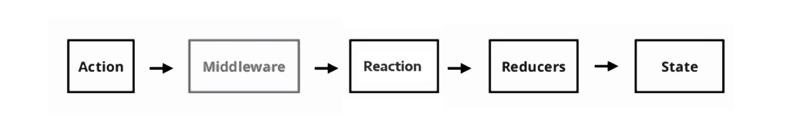

# Modern Modular Middleware Model (4M)

## What is Redux

Redux is a very powerful **state management** tool, often used with a web framework such as React.
Is uses a `store` to hold a global state horizontally throughout a web platform, which makes communication between components much simpler to handle and maintain in complex systems.

### Redux Flow

This is what a Redux data flow looks like :


This does not intend to go over the whole Redux technology by any means. If you do not fully understand this data flow please check out [Redux's documentation](https://redux.js.org/) before going through the next section.

## Middleware

Once used a couple of times, Redux becomes pretty similar accross most projects.

It's real power and complexity relies in its _middleware_.

### What is the 4M ?

The _4M_ consists in relaying all operations, such as complex, redondant, or asynchronous operations to the middleware. **It allows complex flows to be modulary, therefore better reusable, testable and maintainable over time**.

Besides, using middleware accordingly to the 4M allows one to _drastically simplify and standardize the action layer_ by reducing it to a simple **javascript object**, as intended by the native Redux implementation.

A _4M_ compliant middleware is **self sufficient** and **reusable**.

A _4M_ compliant middleware has to use a **unique parent key** to ensure compatibility with other _4M_ compliant middleware. It is suggested to use the name of the `npm` module. Also, it should not override any other keys, unrelated to the given middleware.

A _4M_ compliant middleware can use a new layer in the data-flow called **Reactions**. Reactions are functions executed at the end of a given middleware operation, meant to override the default behaviour of the middleware. They can be used for any purposes, such as action routing.

Reactions, if needed, are passed as arguments in the _action_ layer.

Reactions **must contain** an argument called _next_, passed by the middleware, to allow the user to forward a given action, or several actions, to the reducer (or next middleware), whenever needed.

- Example of simple reactions : `onSuccess`, `onError`, `onThrottle`, `onUnexpectedStatus`,..

- Detailed example of `onSuccess`:

In `/reactions` :

```javascript
export const customReaction = (action, next) => {
  console.log("SUCCESS!", action);
  next(action);
};
```

In `/actions` :

```javascript
    import * as actions from "../constants/action-types";
    import { customReaction } from "../reactions/customReaction";

    export const fetchApi = () => {
      type: actions.FETCH_API,
      payload: [],
      axiom: {
        axios: {
          method:`get`,
          url:`https://itunes.apple.com/search?term=hello`
        },
        onSuccess: customReaction
      }
    }
```

### Redux 4M data-flow



### Examples of use

Middleware could be used for just about anything.
Common uses could include, (not limited to) :

- encryption / decryption
- hashing
- throttling (e.g. [Hurakken](https://github.com/vbuzzegoli/hurakken))
- logging
- analytics
- performance tracking
- networking / REST (e.g. [Axiom](https://github.com/vbuzzegoli/axiom))
- multi-dispatching

## Version

1.2.4

## Credits

Designed by Victor Buzzegoli.

[@victorbuzzegoli](https://twitter.com/victorbuzzegoli) on Twitter
